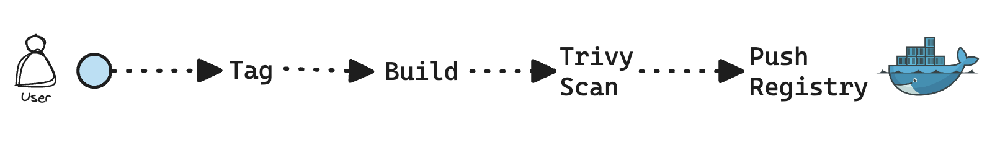
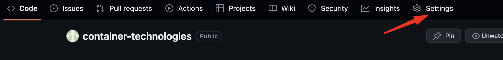
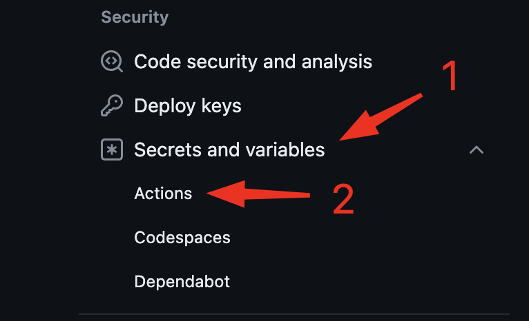
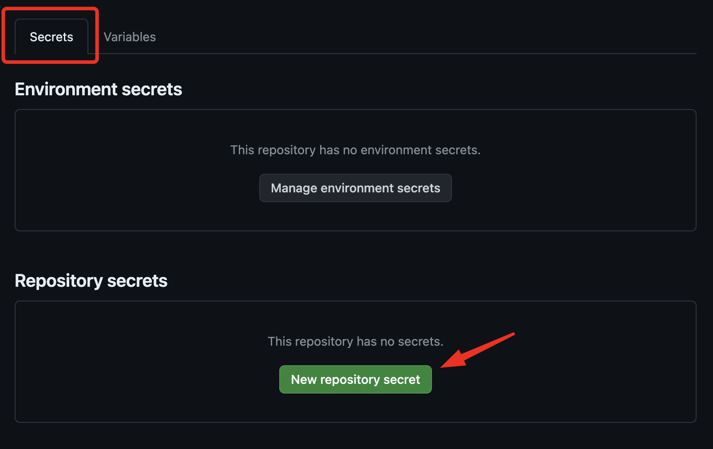
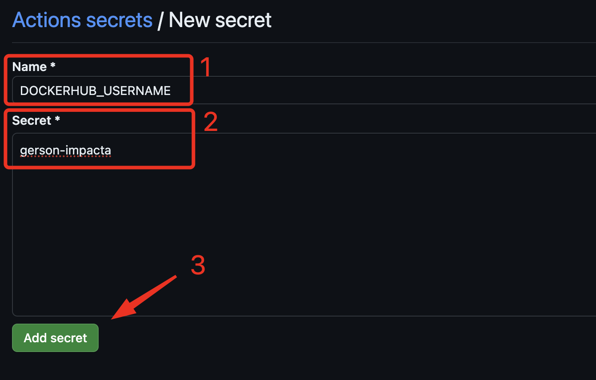
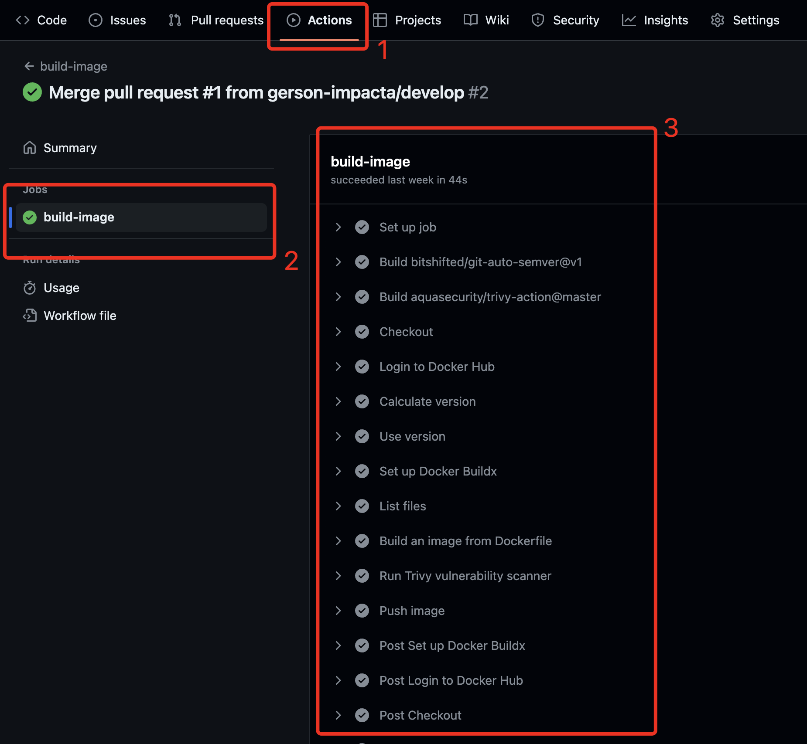

## Aula 2 - Container Technologies

### Automatizando o processo de build

Criar uma pipeline utilizando github actions, utilizando versionamento [semântico](https://semver.org/) de forma automatizada, build da imagem, scan de vulnerabilidades e push para o dockerhub.



1. Crie o repositório no github com nome: container-technologies

2. Configure as secrets do seu dockerhub no github.  
Acesse as configurações do repositório, clique em `Settings`:



3. Em Security, clique em `Secrets and variables`, logo em seguida clique em `Actions`:



4. Clique na aba `Secrets`e clique em `New repository secret`:



5. Em `Name` coloque o nome da SECRET e em `Secret` insira o valor, logo em seguida clique em `Add secret`:



Faça o mesmo processo para as duas secrets:  
`DOCKERHUB_USERNAME` - Insira o username do dockerhub  
`DOCKERHUB_TOKEN` - Insira a senha do dockerhub  

É necessário para realizar o push da imagem no repositório do dockerhub.

6. Neste repositório iremos criar o workflow utilizando github actions, crie os diretórios `.github/workflows` executando o comando abaixo:

```shell
mkdir -p .github/workflows
```
7. Crie o arquivo onde iremos criar os nossos workflows

```shell

touch .github/workflows/app.yaml
```
8. A estrutura deve ficar da seguinte forma:
```shell
.
└── .github
    └── workflows
        └── app.yaml
```
9. No arquivo `app.yaml` iremos configurar os nossos steps do nosso workflow

Insira o conteúdo no arquivo:

```github-actions
name: 'Deploy App'

on:
  push:
    branches:
      - main

env:
  DESTROY: false
  IMAGE_NAME: ${{ github.event.repository.name }}
  APP_VERSION: 1.0.0
  ENVIRONMENT: prod

jobs:
  Build:
    name: 'Building app'
    runs-on: ubuntu-latest
    outputs:
      image_tag: ${{ steps.set_tag.outputs.image_tag }}
    defaults:
      run:
        shell: bash
        working-directory: app

    steps:
      - name: Download do Repositório
        uses: actions/checkout@v4
        with:
          fetch-depth: 0

      - name: Set TAG_APP with SHA
        run: |
          echo "TAG_APP=v${{ env.APP_VERSION }}-$(echo $GITHUB_SHA | cut -c1-7)" >> "$GITHUB_ENV"

      - name: Set TAG_APP Output
        id: set_tag
        run: echo "image_tag=$TAG_APP" >> $GITHUB_OUTPUT

      - name: Show image TAG
        run: |
          echo "Image TAG" $TAG_APP
          echo "Image TAG" ${{ steps.set_tag.outputs.image_tag }}

      - name: Setup Python
        uses: actions/setup-python@v4
        with:
          python-version: '3.10'

      - name: Install Requirements
        run:  pip install flask

      - name: Unit Test
        run: python -m unittest -v test

      - name: Login to Docker Hub
        uses: docker/login-action@v3
        with:
          username: ${{ secrets.DOCKERHUB_USERNAME }}
          password: ${{ secrets.DOCKERHUB_TOKEN }}

      - name: Build an image from Dockerfile
        env:
          DOCKER_BUILDKIT: 1
        run: |
          docker build -t ${{ secrets.DOCKERHUB_USERNAME }}/${{ env.IMAGE_NAME }}:${{ env.TAG_APP }} .

      - name: Run Trivy vulnerability scanner
        uses: aquasecurity/trivy-action@master
        with:
          image-ref: '${{ secrets.DOCKERHUB_USERNAME }}/${{ env.IMAGE_NAME }}:${{ env.TAG_APP }}'
          format: 'table'
          exit-code: '1'
          ignore-unfixed: true
          vuln-type: 'os,library'
          severity: 'CRITICAL'

      - name: Push image
        run: |
          docker image push ${{ secrets.DOCKERHUB_USERNAME }}/${{ env.IMAGE_NAME }}:${{ env.TAG_APP }}
```
10. Na raiz do projeto crie o diretório `app`:

Neste diretório coloque o arquivo app.gz

11. Crie o arquivo `Dockerfile` e coloque o conteúdo:

```Dockerfile
FROM nginx:alpine

ADD app.gz /usr/share/nginx/html/

CMD ["nginx", "-g", "daemon off;"]
```
12. Commitando os arquivos adicionados

```shell
git add .
```

```shell
git commmit -m "Criação do workflow"
```

```shell
git push origin
```
13. Acompanhe a execução do workflow, no repositório clique em `Actions` > `build-image` e acompanhe o workflow.



### Conclusão
Neste laboratório, você aprendeu a automatizar o processo de build de uma imagem Docker utilizando GitHub Actions. Através de uma pipeline configurada com versionamento semântico, você foi capaz de realizar o build da imagem, escanear por vulnerabilidades e fazer o push para o Docker Hub. Este processo não só facilita a integração contínua, mas também garante que as imagens Docker estejam sempre atualizadas e seguras. 
